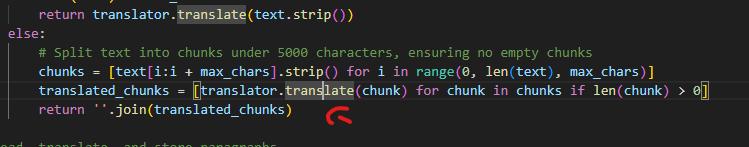
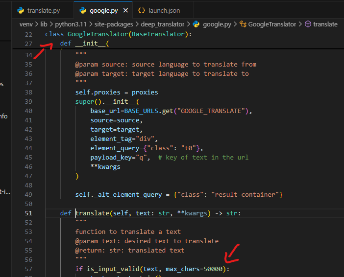

# Project Setup Guide

## Virtual Environment Setup

To start a virtual environment in the local directory, use the following commands:

```bash
python3 -m venv venv
source venv/bin/activate
```

To deactivate the virtual environment, simply run:

```bash
deactivate
```

## Project Structure

Navigate through the project structure as shown in the image below:




Modify the `max_chars` property:

